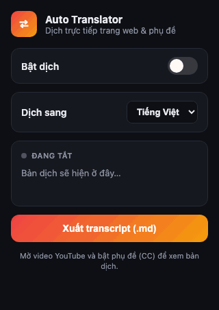

# 🌐 Auto Translator

A **Chrome Manifest V3** browser extension that translates **web pages** and **video captions** into Vietnamese / English **in real time** — right on the page, no copy-paste.

> Translates page content and YouTube captions live, renders an overlay directly on the video, and exports a bilingual transcript as Markdown.

---

## ✨ Features

- **In-place page translation** — scans text nodes, translates and replaces them in the DOM; toggling off restores the originals.
- **Real-time YouTube caption translation** — reads the captions YouTube renders, translates each line, and draws a clean overlay on the video (the native captions are hidden so they never stack).
- **Auto-generated (rollup) caption handling** — buffers word-by-word captions into a settled phrase before translating, so the result isn't choppy.
- **Target language picker** — Vietnamese or English; switching re-translates instantly.
- **Live caption in the popup** — see the current line's original and translation side by side.
- **Export transcript `.md`** — grabs the full video transcript (via YouTube's "Show transcript" panel, or the lines gathered live), as **bilingual text + timestamps**, with a ready-made **AI prompt** at the top so you can paste it into ChatGPT/Claude to summarize.

## 🎬 Demo

**Popup** — toggle, language picker, live caption, transcript export:

<p align="center">
  
</p>

**Quick try (YouTube):**
1. Open an English video and turn on **CC** (captions).
2. Click the extension icon → enable **"Bật dịch"** → pick **Dịch sang: Tiếng Việt**.
3. Vietnamese subtitles appear over the video; the original + translation show in the popup.
4. _(Optional)_ Open **"...more → Show transcript"**, then click **Xuất transcript (.md)** to download the full bilingual script.

## 🛠 Tech stack

- **TypeScript** (strict) — one file = one responsibility, short focused comments.
- **esbuild** — bundles each entry into a self-contained **IIFE** (no dynamic import) so content scripts run even on strict-CSP sites like YouTube.
- **Chrome Extension MV3** — service worker, content scripts, popup, `chrome.storage`.
- **Google Translate** public endpoint (no API key) as the tier-1 translation provider.
- No framework — tiny bundles (a few KB per entry).

## 📦 Install (Load unpacked)

```bash
# 1. Install dependencies
npm install

# 2. Build into dist/
npm run build
```

Then load it into Chrome:

1. Open `chrome://extensions`.
2. Enable **Developer mode** (top-right).
3. Click **Load unpacked** → select the **`dist/`** folder.
4. Pin the icon to the toolbar.

> Chrome loads an unpacked extension straight from the folder — keep `dist/` where it is. After each `npm run build`, hit **Reload** on the extension card and **refresh (F5)** any open tab to pick up the new content script.

## 🧑‍💻 Development

```bash
npm run dev      # esbuild watch — rebuilds on change
npm run build    # type-check (tsc --noEmit) + production build
```

## 🧱 Architecture

Clearly layered, one responsibility per file — providers and stages can be swapped without touching the rest.

```
src/
  core/                      # translation logic (no DOM/browser dependency)
    types.ts                 # domain types + target-language list
    cache.ts                 # cache keyed by (language + text), skips re-translation
    translator.ts            # orchestrator: cache -> provider (tier-2 LLM plugs in here)
    providers/
      provider.ts            # TranslationProvider interface
      google-provider.ts     # tier-1: Google translate endpoint (no key)
    transcript/
      transcript-store.ts    # accumulates caption lines while watching
      markdown.ts            # builds the bilingual Markdown + AI prompt
  background/                # service worker
    index.ts                 # entry: wires the provider into the translator
    message-router.ts        # handles TRANSLATE, translates into the chosen language
  content/                   # runs in the page
    dom-scanner.ts           # collect translatable text nodes
    text-renderer.ts         # write translations / restore originals
    translate-client.ts      # messaging wrapper to the background
    index.ts                 # entry: scan -> translate -> render, reacts to toggle
  platforms/
    youtube/                 # video caption translation
      caption-observer.ts    # watch the captions YouTube renders
      subtitle-overlay.ts    # Vietnamese subtitle box over the player
      transcript-panel.ts    # read the "Show transcript" panel (full script)
      transcript-export.ts   # assemble transcript + return Markdown to the popup
      index.ts               # entry: observe -> translate line -> overlay
  popup/                     # toolbar popup
    index.html
    popup.ts                 # toggle, language picker, live caption, transcript export
  shared/                    # bridges between contexts
    settings.ts              # enabled flag + target language (chrome.storage)
    live-caption.ts          # push the current caption line to the popup
    messages.ts              # typed message contracts
```

**Translation flow:** `translate-client` → `message-router` (background) → `translator` (cache) → `google-provider` (API call). To swap the translation engine, just implement a new provider against `provider.ts`.

## 📝 Notes

- **This is a demo project** — built to showcase the architecture and features, not a production release. It runs via *Load unpacked* and is not published to the Chrome Web Store.
- Uses Google Translate's public (unofficial) endpoint — great for a demo, but swap to Google Cloud Translation / DeepL / an LLM for production stability.
- YouTube captions are read from the DOM (CC must be on); the "full" transcript needs the **Show transcript** panel open.

## 📄 License

[Apache License 2.0](LICENSE)
